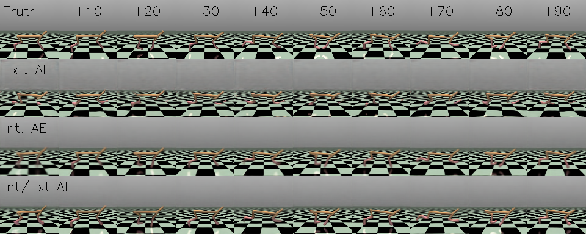
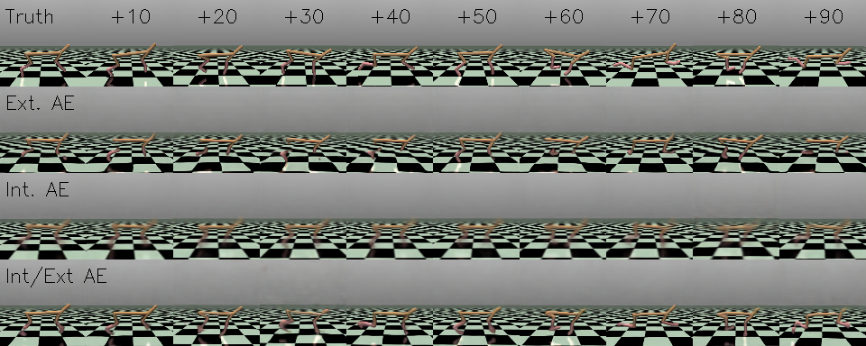

# RSSM and TSSM in PyTorch

This repo includes implementations of two related world modeling techniques: Recurrent State Space Models (RSSM) and Transformer State Space Models (TSSM). These were implemented for imitation learning experiments and thus do not not include reward prediction in their output.

These can be used to model the dynamics of an environment with a neural network, which can then be used in place of a real environment for simulating, search, or even training (since it is differentiable). See my notes on these methods here.

### Results on HalfCheetah-v4

To test this codebase I primarily used HalfCheetah with pixel states and used a SAC expert to collect demonstrations. I explored a variety of ways to include a vision encoder/decoder in the world models. The best method that I found was to train an autoencoder externally (compress/reconstruct pixels from latent space), but to backprop through this network while rolling out the world models (encourage predicted latent states to be decodable under the autoencoder).  

This is method four below ("Int/Ext"), which I compared with a fully external autoencoder ("Ext", world model only operates on latents), and a fully internal autoencoder ("Int", world model decodes to fully pixels with no other reconstruction loss.) Here we see an RSSM observing 10 states, and then rolled out for 90 steps without further observations. The pixels below are predicted solely from the ingested actions and the predicted environment dynamics within the RSSM.

We can do the same for TSSM, which I found to be slightly worse in terms of reconstructions but it may need more training time (or parameters):

### License

This work was authored by Ted Staley and is Copyright © 2024 The Johns Hopkins University Applied Physics Laboratory LLC, please see the LICENSE file.
